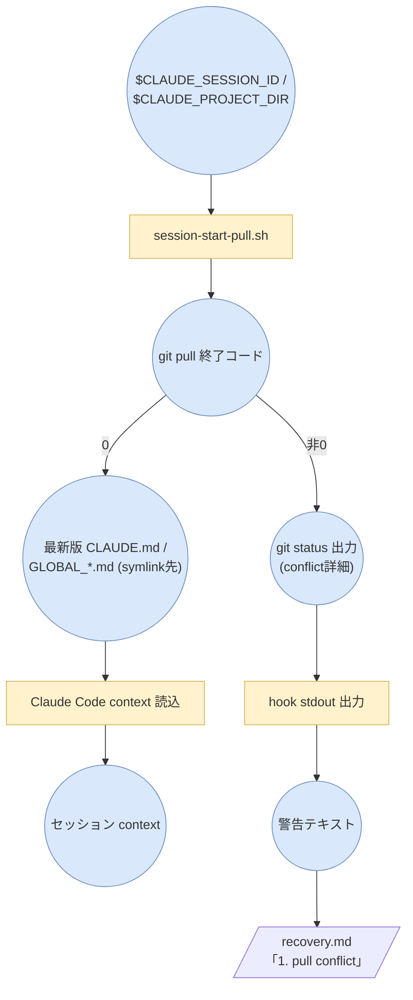
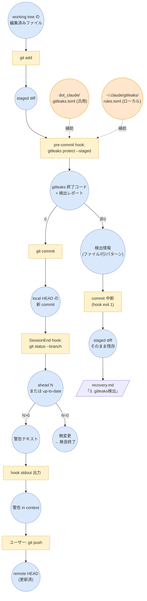

# フロー図

dot_claude 自動管理の各処理を PFD 精神に基づき mermaid で記述する。

PFDの記法・思想（オブジェクト＝丸、タスク＝四角、交互連鎖、具体性の基準、色パレット等）は
[`skills/pfd/SKILL.md`](../skills/pfd/SKILL.md) 参照。

## SessionStart 同期フロー

## commit 〜 push フロー

## 異常系への接続

各フロー末尾の `recovery.md「...」` ノードが異常系への分岐点。対応手順は [`recovery.md`](recovery.md) 参照。
