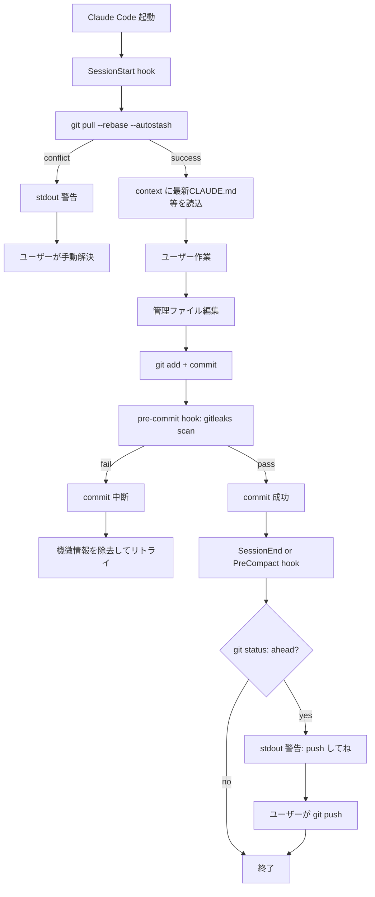
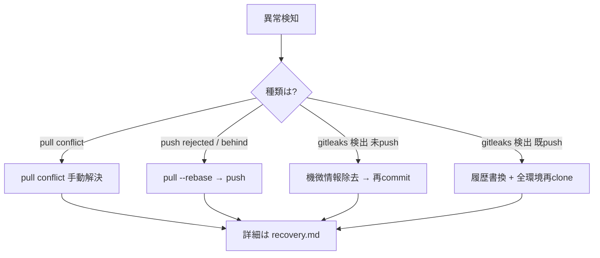

# フロー図

## 正常系: 実装後のセッションフロー



## 異常系: 分岐とリカバリー



## ファイル関係図

```mermaid
flowchart LR
    subgraph dot_claude repo
        A[dot_claude/.githooks/pre-commit]
        B[dot_claude/.gitleaks.toml<br/>汎用ルール: API key等]
        C[dot_claude/scripts/hooks/<br/>session-start-pull.sh 等]
        D[dot_claude/settings.json]
    end
    subgraph local only
        E[~/.claude/gitleaks/rules.toml<br/>取引先名等 gitignore対象]
    end
    subgraph external
        F[gitleaks バイナリ<br/>各OSに別途インストール]
    end
    A -.呼出.-> F
    F -.--config.-> B
    F -.--config.-> E
    D -.hook登録.-> C
```

詳細は [recovery.md](recovery.md) を参照。

---

## PFD 精神を踏襲した箇条書きフロー

### 記法
- `◯` = オブジェクト（ファイル・環境変数・stdout・終了コード等の実体）
- `[ ]` = タスク（関数）
- **`◯ → [ ] → ◯` の交互連鎖**（タスク直結禁止）
- オブジェクトは抽象名でなく**具体名**で書く（詳細は SKILL.md「オブジェクトの具体性」）

### SessionStart 同期フロー

```
◯ $CLAUDE_SESSION_ID / $CLAUDE_PROJECT_DIR
  → [ session-start-pull.sh ]
  → ◯ git pull 終了コード

├─ 0   → ◯ 最新版 CLAUDE.md / GLOBAL_*.md (symlink先)
│        → [ Claude Code context 読込 ]
│        → ◯ セッション context
│
└─ 非0 → ◯ git status 出力 (conflict詳細)
         → [ hook stdout 出力 ]
         → ◯ 警告テキスト
         → recovery.md「1. pull conflict」
```

### commit 〜 push フロー

```
◯ working tree の編集済みファイル
  → [ git add ]
  → ◯ staged diff
  → [ pre-commit hook: gitleaks protect --staged ]
     補助入力:
       ◯ dot_claude/.gitleaks.toml (汎用)
       ◯ ~/.claude/gitleaks/rules.toml (ローカル)
  → ◯ gitleaks 終了コード + 検出レポート

├─ 0   → [ git commit ]
│        → ◯ local HEAD の新 commit
│        → [ SessionEnd hook: git status --branch ]
│        → ◯ "ahead N" または "up-to-date"
│
│        ├─ N>0 → ◯ 警告テキスト
│        │        → [ hook stdout 出力 ]
│        │        → ◯ 警告 in context
│        │        → [ ユーザー: git push ]
│        │        → ◯ remote HEAD (更新済)
│        │
│        └─ N=0 → ◯ 無変更 → 無音終了
│
└─ 非0 → ◯ 検出情報 (ファイル・行・パターンID)
         → [ commit 中断 (hook exit 1) ]
         → ◯ staged diff そのまま残存
         → recovery.md「3. gitleaks検出」
```

### 読み取り方
- **タスク = 関数**: 入力 ◯ を読み、出力 ◯ を生成する
- **オブジェクト = 実体**: 後続タスクが何に触れるか確定する名前
- **合成可能性**: 前タスクの出力 ◯ が次タスクの入力 ◯ と一致するか目視確認できる
- **補助入力**: 設定ファイル等は該当タスク配下に列挙、主フローの視認性を保つ
