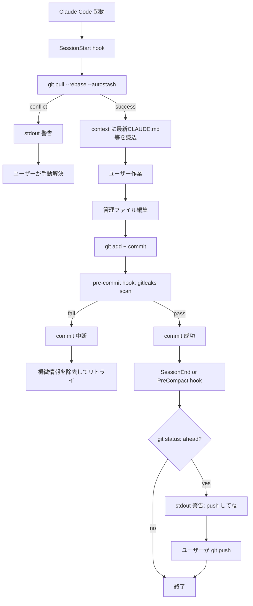
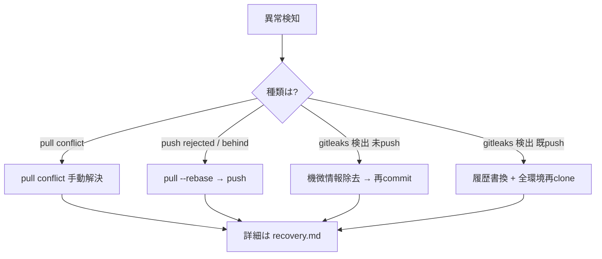

# フロー図

## 正常系: 実装後のセッションフロー



## 異常系: 分岐とリカバリー



## ファイル関係図

```mermaid
flowchart LR
    subgraph dot_claude repo
        A[dot_claude/.githooks/pre-commit]
        B[dot_claude/.gitleaks.toml<br/>汎用ルール: API key等]
        C[dot_claude/scripts/hooks/<br/>session-start-pull.sh 等]
        D[dot_claude/settings.json]
    end
    subgraph local only
        E[~/.claude/gitleaks/rules.toml<br/>取引先名等 gitignore対象]
    end
    subgraph external
        F[gitleaks バイナリ<br/>各OSに別途インストール]
    end
    A -.呼出.-> F
    F -.--config.-> B
    F -.--config.-> E
    D -.hook登録.-> C
```

詳細は [recovery.md](recovery.md) を参照。

---

## PFD 精神を踏襲した箇条書きフロー

タスク（動作）とオブジェクト（入出力データ）を分離して記述。タスク間は必ずオブジェクトを介して接続する（PFD の原則）。

### SessionStart 同期フロー

```
【タスク】Claude Code 起動
  └→ 出力オブジェクト: SessionStart イベント

【タスク】session-start-pull.sh 実行
  ├← 入力: SessionStart イベント
  ├← 入力: remote HEAD（git fetch で取得）
  ├← 入力: local HEAD
  └→ 出力: pull 結果 {success | conflict | error}

分岐:
  - success       → 【タスク】context 読込
                      ├← 入力: 最新 CLAUDE.md, GLOBAL_*.md（symlink経由で最新）
                      └→ 出力: Claude コンテキスト
  - conflict/error → 【タスク】stdout 警告
                      └→ 出力: 警告メッセージ
                      └→ 次アクション: recovery.md「1. pull conflict」へ誘導
```

### commit 〜 push フロー

```
【タスク】ユーザーが管理ファイル編集
  └→ 出力: 編集済みファイル

【タスク】git add + commit
  ├← 入力: 編集済みファイル
  └→ 出力: staging 差分

【タスク】pre-commit hook（gitleaks scan）
  ├← 入力: staging 差分
  ├← 入力: dot_claude/.gitleaks.toml（汎用ルール: API key等）
  ├← 入力: ~/.claude/gitleaks/rules.toml（ローカルルール: 取引先名等）
  └→ 出力: 判定 {pass | fail}

分岐:
  - pass → commit 成立（commit オブジェクト生成）
  - fail → commit 中断
          → 次アクション: recovery.md「3. gitleaks検出」へ誘導

【タスク】SessionEnd/PreCompact hook（git status 検査）
  ├← 入力: git status --branch 出力
  └→ 出力: ahead 判定 {N > 0 | N == 0}

分岐:
  - ahead > 0  → stdout 警告「push してね」
                → ユーザーアクション: git push
  - ahead == 0 → 無音終了
```

### 読み取り方
- `【タスク】` = 動作（プロセス、関数、スクリプト）
- `入力 / 出力` = オブジェクト（ファイル・データ・判定結果）
- タスク同士は直接つながらず、必ずオブジェクトを受け渡して接続される
- 分岐は判定オブジェクトの値で分かれ、先のタスク（または回収フロー）へ接続する
