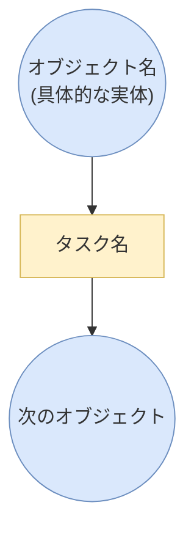

# ProcessFlowDiagram (PFD) 描画スキル

「フローを描いて」「ProcessFlowDiagramで」「PFDで」と指示された場合は本スキルに従う。出力形式は **drawio / mermaid / 箇条書き** のいずれか（ユーザー指示または文脈で判断）。形式が異なっても**PFD精神（タスク＝関数、オブジェクト＝入出力、交互連鎖、具体性）は共通**。

## 設計思想（Why）

PFDは**タスクを関数として扱う**フロー記法。

- タスク = 関数 `f: 入力オブジェクト → 出力オブジェクト`
- オブジェクト = 関数の引数と戻り値の実体

**入出力オブジェクトが明示されていないタスクは「描けていない」**。
型の定まらない関数と同じで、後続タスクとの**合成可能性（composability）を検証できない**ため。

タスク間の直接接続を禁止するのも、関数合成の境界を可視化するため。
`task1 → task2` の直結は「task1の出力 = task2の入力」という合成成立を
暗黙化し、読み手が検証できなくなる。

### オブジェクトの具体性

オブジェクトは「実態のあるファイル・生成物・入力物」と定義される。
抽象名（"イベント"、"状態"、"結果"）ではなく、**後続タスクがそれを入力と
して受け取ったとき何に触れるか**が確定する名前を付ける:

| 悪い例（抽象） | 良い例（実体） |
|---|---|
| "SessionStart イベント" | "$CLAUDE_SESSION_ID / $CLAUDE_PROJECT_DIR 環境変数" |
| "pull 結果" | "git pull 終了コード (0=success, 非0=conflict)" |
| "commit 状態" | "git status --branch の stdout（ahead N 含む）" |

具体性の基準: **その名前だけで後続タスクが何を読めばよいか分かるか**。

## 使用要素

| 要素 | drawio style | mermaid記法 | 箇条書き記法 | 用途 |
|------|-------------|-------------|-------------|------|
| 丸オブジェクト | `ellipse` | `X(("..."))` | `◯ ...` | 実態のあるファイル・生成物・入力物（以下「オブジェクト」） |
| 四角オブジェクト | `rounded=0` (rectangle) | `X["..."]` | `[ ... ]` | タスク・関数・プロシージャ（以下「タスク」） |
| 実線矢印 | `endArrow=classic` | `-->` | `→` | タスクへの入力、タスクからの出力 |
| 点線矢印 | `endArrow=classic;dashed=1` | `-.->` | `-.->` | **フローが戻る場合のみ**。ラベル文字は付けない |
| 補助入力矢印（実線） | orthogonalEdgeStyleで端を迂回（`dashed`は使わない） | `-->`（迂回配置で表現、ラベルなし） | `補助入力:` として配下列挙（矢印自体は無地） | 主フローとは別系統の設定等。ノードの色（橙=設定・緑=外部成果物）で区別する |
| 色分け・グルーピング | fillColor/strokeColor | `classDef` | — | 同系列のオブジェクトは同色、関連タスクはグループ化 |
| 未実装要素 | 枠線`dashed=1` + `fontColor=#999999` | `classDef pending ...` | `（未実装）` | 設計済みだが未実装であることを示す |

## ルール

### 接続ルール
1. **タスクの入出力**: タスクには必ず入力オブジェクトと出力オブジェクトがある。空を入力する場合はその旨オブジェクトに記載する
2. **タスク間の接続禁止**: タスクとタスクが実線矢印で直接つながることはない。必ず間にオブジェクトを挟む
3. **フロー方向**: 基本は上→下の1方向。フロー的に戻る場合のみ点線矢印を使う
4. **矢印は全てオブジェクト⇔タスク間**: オブジェクト→タスク（入力）、タスク→オブジェクト（出力）のみ
5. **矢印に文字ラベルを付けない**: 遷移線（矢印）はオブジェクトとタスクの接続のみを表し、テキストラベルを持たせない。分岐・条件・イベント名など意味のある情報は、具体的な名前を持つオブジェクト/タスクのノードとして明示する。例: 承認ゲートは「PR レビュー承認」タスク＋「承認済み plan」オブジェクトとして表現し、矢印に「レビュー承認」とラベルしない。分岐は分岐先ごとに具体的な名前のオブジェクトへ分ける（例:「検証OK設定」/「検証NG差し戻し」であり、単に「はい」「いいえ」とラベルしない）
6. **点線は遷移の戻り（ループ）専用**: 点線矢印を使うのはフローが前段タスクへ戻る場合のみ。**補助入力・設定・未実装/将来機能は点線にしない** — 実線＋ノードの色分け（橙=設定、緑=外部成果物、グレー=未実装）＋ノード自体の破線枠（未実装要素の境界のみ）で表現する。未実装要素への矢印はグレーの実線でよい（ルール9）が、破線にはしない

### 色ルール
7. **同系列の整列**: 入力Aが出力Bになるとき同系列（例: `受講者:未受講` → `受講者:タスク1実施済`）なら、可能な限り縦座標を揃えて同じ色を使う
8. **異なる意味は異なる色**: タスク、設定、入力データ、中間生成物、最終出力はそれぞれ別の色で区別する
9. **未実装要素からの矢印もグレー**: 未実装オブジェクト/タスクに接続する矢印は`strokeColor=#999999`で描く（点線にはしない。ルール6）

### レイアウトルール
10. **メインストリームを中央に**: メインのデータフロー（最も重要な入力→最終出力）を図の縦中央軸に配置する
11. **補助入力は端に退避**: 設定ファイル・メタ情報など補助的な入力は左端または右端に配置し、メインフローの視認性を確保する
12. **グルーピングは最背面**: グループ枠はXML上で他の要素より先に記述し、最背面に描画する
13. **分岐は左右対称**: フローが分岐する場合、左右対称に配置する
14. **矢印の交差を最小化**: 矢印の経路は交差が少ない配置を優先する。`edgeStyle=orthogonalEdgeStyle`で直角折れを使い整理する
15. **補助入力からの矢印は`orthogonalEdgeStyle`で端を迂回**: 補助入力→タスクの矢印はメインフローを横切らないよう外側を回す（実線のまま）
16. **矢印はオブジェクトやグループ枠を突き抜けない**: 矢印を蛇行させるのではなく、オブジェクト同士の配置間隔を広げて直線的な矢印が被らないようにする。図全体の幅・高さが大きくなることを許容する

## 生成前のレイアウト計画（必須）

**XMLを書く前に、以下の計画をテキストで行うこと。**

### Step A: 接続一覧の作成
全オブジェクトとタスクを列挙し、矢印の接続一覧を作る。

### Step B: グループ分類
どのオブジェクト/タスクがどのグループに属するかを整理する。

### Step C: グループ間矢印の特定
ソースとターゲットが**異なるグループに属する（または一方がグループ外にある）矢印**を特定する。これが「グループ枠を横断する矢印」。

### Step D: 横断矢印の経路確保
横断矢印ごとに、以下のいずれかで対処を決める:
- **直線で通せる場合**: ソースとターゲットの間にグループ枠が存在しないよう、グループの配置を調整する（グループ間に十分な空間を空ける）
- **直線では必ずグループ枠を横切る場合**: その矢印を`orthogonalEdgeStyle`にして、`exitX/exitY`と`entryX/entryY`でグループ枠の外側を通る経路を指定する

### Step E: グループ枠のサイズ決定
各グループに属するオブジェクト/タスクの座標を決めた後、グループ枠のサイズを決める:
- 内部の全オブジェクトから**上下左右に20px以上**の余白を確保
- グループ枠のラベル分として**上部に追加で25px**確保

### Step F: 座標テーブルの作成
全要素の(x, y, w, h)を一覧にしてから、XMLを書き始める。

## 構造パターン

```
              [補助入力]                    [補助入力]
               (左端)                       (右端)
                 │                            │
                 │    [メイン入力]             │
                 │     (中央上)               │
                 │        │                   │
                 └──→ [タスク1] ←─────────────┘
                          │
                     [中間生成物]
                      (中央)
                    ┌────┴────┐
               [タスク2]    [タスク3]
                 (左)         (右)
                  │            │
              [出力A]      [出力B]
                  │            │
                  └──→ [統合] ←┘
                         │
                    [最終出力]
```

## drawio実装メモ

- 丸: `style="ellipse;whiteSpace=wrap;html=1;"`
- 四角: `style="rounded=0;whiteSpace=wrap;html=1;"`
- 実線矢印: `style="endArrow=classic;html=1;"`（`value`属性は設定しない＝矢印にテキストを持たせない）
- 点線矢印: `style="endArrow=classic;html=1;dashed=1;"`（**ループの戻り専用**。補助入力・未実装への矢印には使わない）
- 直角折れ矢印: `style="edgeStyle=orthogonalEdgeStyle;html=1;entryX=...;entryY=...;exitX=...;exitY=...;"`
- グループ: `style="rounded=1;dashed=1;fillColor=none;strokeColor=#666666;fontSize=10;fontColor=#666666;verticalAlign=top;align=left;"`
- 未実装オブジェクト: `style="ellipse;whiteSpace=wrap;html=1;dashed=1;strokeColor=#999999;fontColor=#999999;fillColor=#f5f5f5;"`
- 未実装タスク: `style="rounded=0;whiteSpace=wrap;html=1;dashed=1;strokeColor=#999999;fontColor=#999999;fillColor=#f5f5f5;"`
- 未実装への矢印: `style="endArrow=classic;html=1;strokeColor=#999999;"`（`dashed=1`は付けない。グレーの実線）

### 色パレット（drawio / mermaid 共通）
| 用途 | 色 | fill | stroke |
|------|-----|------|--------|
| タスク | 黄 | `#fff2cc` | `#d6b656` |
| 設定・パラメータ | 橙 | `#ffe6cc` | `#d79b00` |
| 映像系データ | 青 | `#dae8fc` | `#6c8ebf` |
| 音声系データ | 緑 | `#d5e8d4` | `#82b366` |
| 中間生成物 | 紫 | `#e1d5e7` | `#9673a6` |
| 最終出力 | 赤 | `#f8cecc` | `#b85450` |
| 外部API | 緑 | `#d5e8d4` | `#82b366` |
| 未実装 | グレー | `#f5f5f5` | `#999999` |

## mermaid 実装メモ

mermaid で PFD を描くときの最小規約:



- オブジェクトは `(( ))`（円）、タスクは `[ ]`（矩形）
- ノードIDは `O*` / `T*` の命名で役割を明示すると可読性が上がる
- 長いラベルは `<br/>` で改行
- 補助入力は実線 `-->` でつなぎ、ノードの色（橙=設定・緑=外部成果物）で主フローと区別する。**点線にもラベルにもしない**
- **矢印にラベルを付けない**（`-->|"..."|` は使わない）。分岐が必要な場合は分岐先ごとに具体的な名前のオブジェクトへ分ける（例: `検証OK設定` / `検証NG差し戻し`）
- 点線 `-.->` はループの戻り（前段タスクへの回帰）専用。それ以外では使わない
- 最後に `classDef` + `class ... obj/task` で色を揃える
- **mermaid でも「タスク→タスク」直結は禁止**（必ずオブジェクトを挟む）

### XML記述順序
1. グループ枠（最背面）
2. オブジェクト（丸）
3. タスク（四角）
4. 矢印（エッジ）

## 生成手順

PFDの生成は以下の手順で行う:

1. **レイアウト計画**（上記Step A〜F）をテキストで出力する
2. **drawio XMLを生成**して保存
3. **`drawio_lint.py`を実行**して直線矢印のオブジェクト交差とグループはみ出しをチェック
   ```
   uv run python drawio_lint.py <ファイル名>.drawio
   ```
4. **交差/はみ出しが検出された場合**: 自動修正される（オブジェクトシフト、グループ枠拡張）
5. **再度lintを実行**（最大2ループ）。2ループで解消しなければそのまま採用
6. 不要な中間ファイル(`_fixed.drawio`)を削除

※ lintは直線矢印のみチェック。orthogonalEdgeStyle（折れ線）矢印は回避能力があるため対象外
